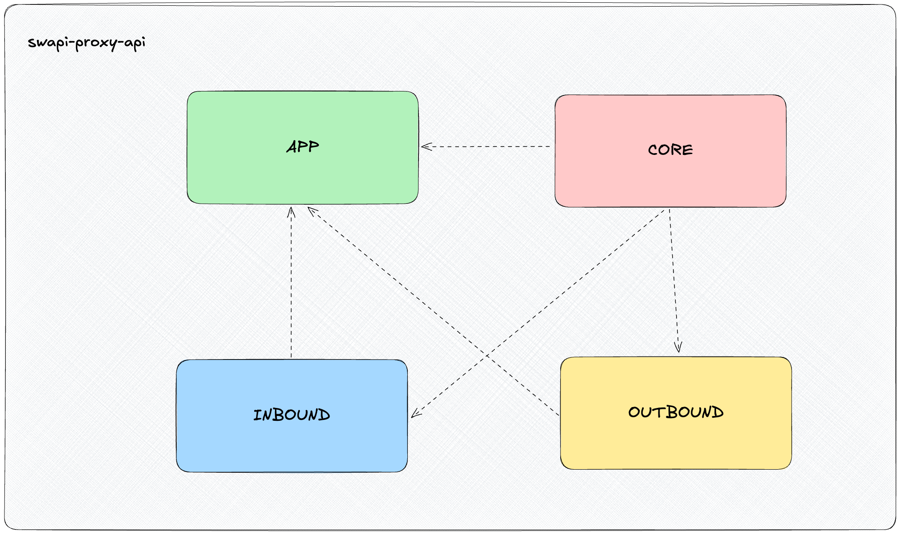
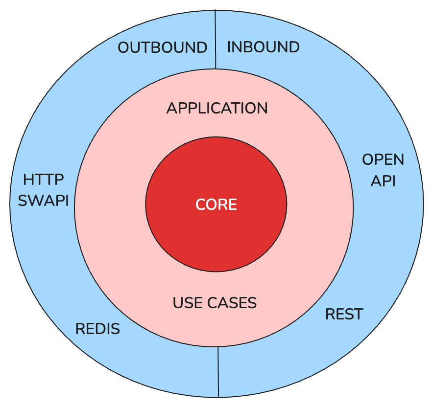

# 🌌 swapi-proxy-api

## 🚀 Requisitos

- ☕ Java 21
- 📦 Maven 3.8.6 o superior
- 🐳 Docker
- 🧠 Redis (se incluye como contenedor en el Docker Compose)

## 📥 Instalación

Para instalar las dependencias sin ejecutar los tests, ejecuta el siguiente comando:

```sh
make install-dependencies
```

O si lo prefieres con Maven:

```sh
mvn clean install -DskipTests
```

## ▶️ Ejecución

Para iniciar la aplicación con Docker Compose, ejecute el siguiente comando:
```sh
make start-app
```

O si lo prefieres con Docker Compose:

```sh
docker-compose up --build
```

## 🧪 Pruebas

Para ejecutar las pruebas unitarias, ejecute el siguiente comando:

```sh
mvn test
```

## 📄 Acceso a Swagger

Puede acceder a la documentación de Swagger en la siguiente URL:  http://localhost:8080/swagger-ui/index.html


## 📚 Arquitectura del proyecto


- APP: Aquí se gestiona todo lo relacionado a la carga de variables de entorno y la ejecución de la aplicación.
- CORE: Aquí gestionamos todo lo relacionado a la lógica de negocio y sus casos de uso.
- INBOUND: Aquí se levantan los controladores que hacen de entrada a nuestro sistema, en este caso, endpoints REST.
- OUTBOUND: Aquí se gestionan todas las llamadas a servicios externos.

En lo relativo a las relaciones entre módulos, se puede observar que los módulos **INBOUND y OUTBOUND dependen del módulo CORE**, ya que necesitan acceder a la lógica de negocio que se encuentra en este módulo.
APP depende de todos los módulos y necesita que **todos estén disponibles** para poder ejecutar la aplicación.
CORE no depende de ningún módulo(teóricamente), ya que es el módulo que contiene la lógica de negocio y no necesita acceder a la lógica de otros módulos. En todo caso si requiere de algo, se realiza siempre la llamada mediante interfaces y la inyección de dependencias se la delegamos a Spring.

También se ha seguido un enfoque de **Clean Architecture** en el que se ha dividido la aplicación en capas, de tal forma que la capa más interna es la que contiene la lógica de negocio y las capas más externas son las que se encargan de la entrada y salida de datos. Toca comunicación entre capas se realiza mediante interfaces, a excepción de los casos de uso, que en este caso solo tenemos uno y es invocado manualmente, pero no supone ningún problema. Y por reflejarlo en otra imagen mas familiar, se vería de la siguiente manera:



# ¡Listo para usar! 🥳 🎉
